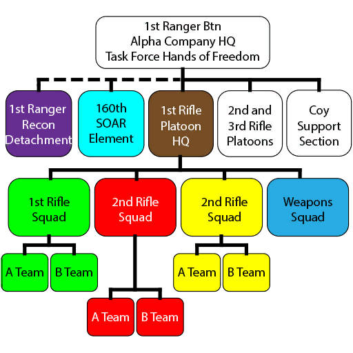
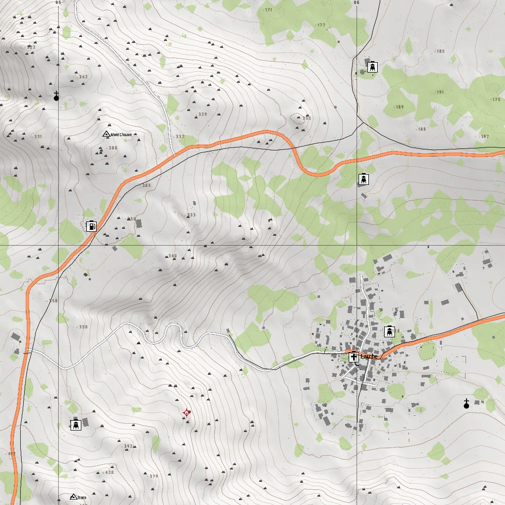
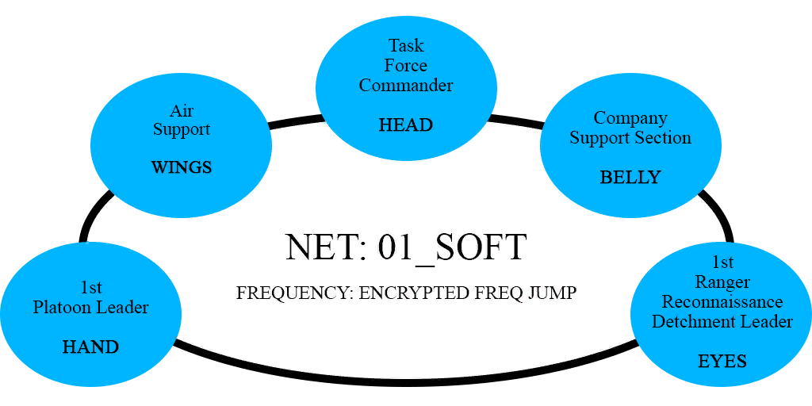
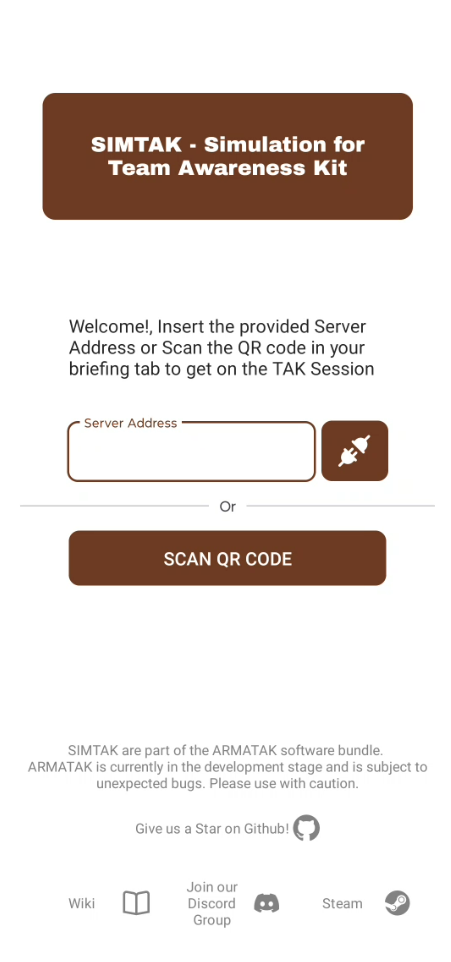
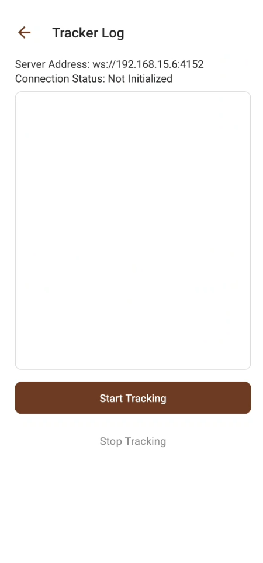
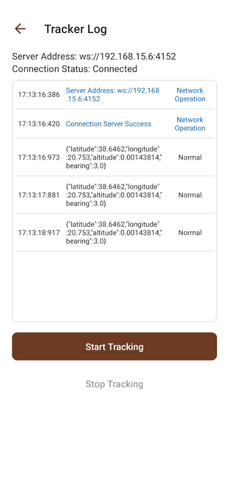
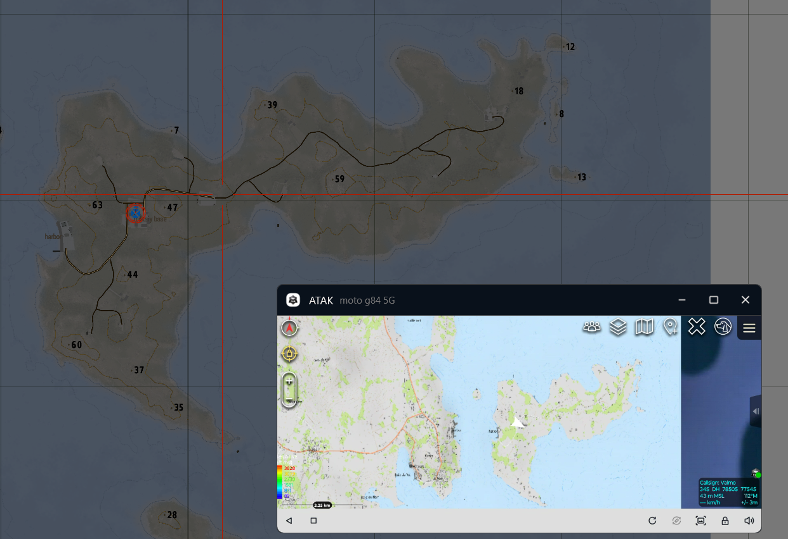

# Operation Hands of Freedom

## Situation

After decades of violence, chaos and useless military intervention done by the united nations in Haiti, the caribbean country faces the same problems as always. After some internatiocal pressure, a humanitary aid was (re)deployed by united nations trying to help the poor population of Haiti. The humanitary mission was a complete failure, most of the united nation assets was stolen by local gangs that controls 90% of the haitian territory. A group of united nation workers were taken hostage from local gangs that demands for money in exchange of their lifes. The USG prepares a Task Force from the 75th Ranger Regiment to rescue the hostages and intimidate haitian gangs to avoid any harm to US citizens.

### Force Composition



(Those colors are that same that will be used by the EUD's callsign on ATAK)

## Mission

Infiltrate in denied territory and execute a **personnel recovery** operation on american civilians captured in Haiti.

## Execution



### Concept of Operation

The Task will infiltrate by airmobile in the AO ASAP, seize and secure the enemy compound on Larche, rescue the civilians and exfiltrate to a safe zone as quick as possible. Using any means necessary to safe rescue the hostages and demonstrate force on Haitian thugs.

### Order to Subordinate Elements

#### Task Force/Coy HQ

SUPERvision, COrdination and COntrol of the Task Force.

#### 1st Ranger Recon Detachment

Infiltrate before the rest of the Task Force, occupy a Observation Post in order to collect intel about reserve enemy forces on the AO, different information about the ones provided by the Military Intelligence about the enemy compound. Guide air suppport if necessary and exfiltrate joining the rest of the Task Force.

#### 1st Platoon HQ

Being the Leader inside the AO, control the moviment of the Rifle Squads and ensure the mission success without any casualty.

#### 1st Rifle Squad

be the main assault force, taking the vanguard on the Task Force moviment inside the AO.

#### 2nd Rifle Squad

Equipped with mission critical equipment, one team will secure the hostages when need and transport then to a safe zone, the other team will search for intel inside the compond.

#### 3rd Rifle Squad

Provide segurance doing siege during main assault and compond security if necessary.

#### Weapons Squad

Act as close reserve force

## Logistics

* Water and MRE's won't be necessary due to the very short time inside the AO.
* Personnel Replenishment (respawn) will not be allowed during the mission, except for technical issues by fault of the Task Force HQ.
* All supply categories will be avaliable only inside the safe zone, Task Force HQ must be required for the ressuply, air support is able to airlift ressuplies if necessary and coordinated with the ground forces. There is no free usage of personal equipment.
* Task Force HQ Medics are able to perform most of the medical procedures inside the AO.

## Communications

### Radio Network



| Fractions | Network | Channel |
| ------------- | ------- | ----|
| Task Force HQ | 01_SOFT | 1 |
| RTOs, FSEs, Air Support | 02_Eagle | 2 |
| 1st Rifle Squad | 10_M4SQ | 3 |
| 2nd Rifle Squad | 20_M4SQ | 4 |
| 3rd Rifle Squad | 30_M4SQ | 5 |
| Weapons Squad | 40_GOOSE | 6 |
| 1st RRD | 03_EYES | 7 |

### Team Awareness Kit

#### Device Preferences defined

Settings // CallSign and Device Preferences // Callsign Preferences

##### Callsigns

The player's nickname, please don't define your function here.

##### Teams

| Fraction | Color |
| -------- | ----- |
| 1st RRD | Magenta |
| Air Support | Blue |
| Platoon HQ | Brown |
| 1st Squad | Green |
| 2nd Squad | Red |
| 3rd Squad | Yellow |
| Weapons Squad | Dark Blue |

##### Roles

| Function | Role |
| -------- | ---- |
| Officers | HQ |
| Squad Leaders | Team Lead |
| RTOs, Radio Ops, Air Support | RTO |
| Medics | Medic |
| Every other functions, including team leaders | Team Member |

## Attach A - ARMATAK Quick Start

It's highly recommended to configure ARMATAK stuff locally BEFORE you're joining a multiplayer session.

ATAK -> Android App for Situation Awareness  
ARMATAK -> Arma 3 mod that sends the player's position to a websocket connection  
SIMTAK -> App that will connect into a websocket and mock the device's location based on information provided by the websocket.

### ARMATAK and SIMTAK installation

```markdown
DISCLAIMER: ATAK is not mandatory for most players, but is highly recommend for learning C2 stuff and enhanced situation awareness, Officers and Squad Leaders must use it in order to keep a decent control of the area of operation CoTs (Cursor over Time, markers of player's position).
```

Steps:

1. Download the [ARMATAK mod from Steam Workshop](https://steamcommunity.com/sharedfiles/filedetails/?id=3301306282).
2. Open the Mod content folder
3. Move the simtak.apk file to your android phone
4. Open the simtak.apk file on your phone, it's a android app installation package, in order to install a app from outside the playstore, you must explict authorize that.  

**Samsung Devices** - If you are using a Samsung device, there is a "Adaptive Battery" feature for battery saving that will break SIMTAK or apps that runs services on background. In order to solve it, users must follow the "Solution for users" tab on [this website](https://dontkillmyapp.com/samsung).

### ARMATAK and SIMTAK usage

Just by starting a game (even on briefing screen), ARMATAK's websocket will be running by default, but you can check if it's up and running on the log located in:  

```path
<your arma 3 mod folder>/armatak.log
```  

It should be getting something like this:

```log
2024-12-12T02:46:04.470687400-03:00 armatak::websocket - WebSocket server started.
2024-12-12T02:46:04.471617600-03:00 ws - Listening for new connections on 0.0.0.0:4152.
```

Then you can get your phone and open SIMTAK, it should look like this:



On the server address, add your websocket address connection, if ARMATAK is running fine, it should be like this:  

```ip
ws://<your address>:4152
```

If your computer running Arma 3 with ARMATAK and your phone are on the same Wifi router, the computer local address should be able to connect (ipconfig on command prompt and you will can check it), if your cellphone is not on the same network as your computer, you will have to port forward the port 4152 to your computer in order to allow external connections to ARMATAK socket. After pressing the connect button, you should check the following screen:



If you cannot see the "Not Initialized" message, you're probably using a Samsung Phone with adaptive battery enabled, check the installation step to handle it. Now, you can press the "Start Tracking" button in order to connect to the WebSocket and start mocking the location.



After started the connection, you should see those "Connection Server Success" messages, and then a message containing the player's information will be prompt every second, you can now switch to the ATAK app (without closing the SIMTAK app).


