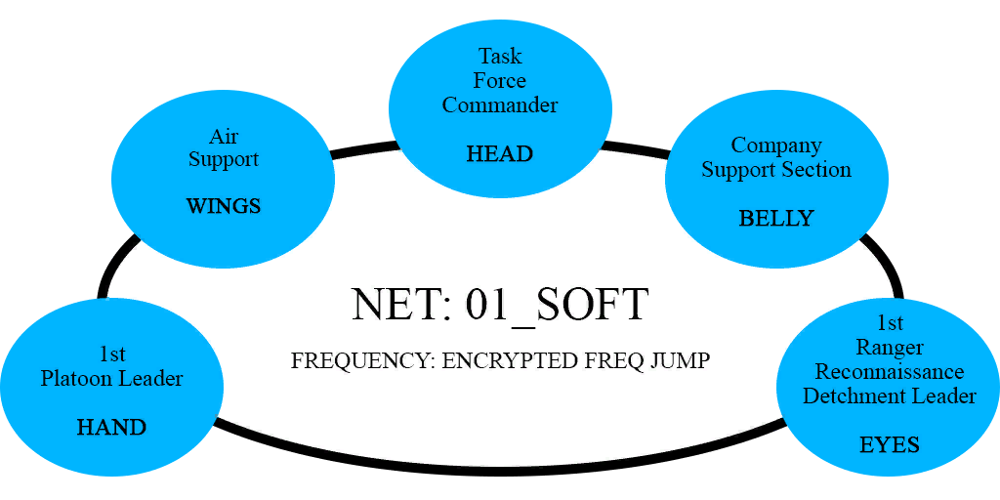

# Operação Mãos da Liberdade

## Situação

Após décadas de violências, caos e uma fracassada intervenção militar feila pela ONU no Haiti, o país caribenho enfrenta o mesmo problema de sempre. Após certa pressão internacional e crescente violência perante o falido estado, uma missão de ajuda humanitária foi (re)enviada pela ONU, a fim de ajudar a população carente do Haiti. A missão humanitária mostrou-se outro completo fracasso. Com diversos meios da ONU sendo roubados ou destruídos por gangues haitianas que disputam o território entre si. Um grupo de trabalho das nações unidas composto por cidadãos americanos foi capturado e feito refém por uma gangue local em Larche, que cobra uma recompensa pela soltura dos reféns. O governo americano, enquanto negocia a soltura dos reféns prepara uma força tarefa a fim de resgatar os reféns.

### Composição da Força

(As cores dos grupos são as mesmas que devem ser usadas no ATAK, vide Anexo A)

## Missão

Infiltrar em território hostil e resgatar civis americanos nas mãos de bandidos haitianos.

## Execução

### Conceito da Operação

A Força Tarefa irá infiltrar por meios aeromóveis assim que possível, assegurar a localidade inimiga em Larche, resgatar os civis e exfiltrar para uma zona segura assim que possível, usando todos os meios necessários para salvaguardar os reféns e demonstrar força perante os criminosos haitianos.

### Ordem aos Elementos Subordinados

#### Task Force/Coy HQ

Supervisão, controle e coordenação da Força Tarefa

#### 1st Ranger Recon Detachment

Infiltrara antes do resto da Força Tarefa, ocupar um Posto de Observação a fim de coletar informações e agir como elemento reserva na área de operações, estando em condições de guiar apoio aéreo se necessário e exfiltrar juntamente com o resto da Força Tarefa.

#### 1st Platoon HQ

Líder da missão dentro da Área de Operação, contra o movimento dos Squads e assegura o sucesso da missão sem baixas.

#### 1st Rifle Squad

Força Primária de Assalto, assume a vanguarda da Força Tarefa dentro da AO.

#### 2nd Rifle Squad

Equipado com equipamento crítico para o sucesso da missão, um time irá resgatar o refém enquanto outro irá procurar informações na localidade.

#### 3rd Rifle Squad and Weapons Squad

Provém segurança de cerco às demas frações

## Logística

* Água e reção não serão necessárias dado o curto tempo dentro da AO.
* Recompletamente de pessão não será aceito durante a missão, exceto para resolução de problemas técnicos.
* Todas as classes de suprimentos poderão ser providas na área segura ou por meios aeroterrestres.

## Comunicações

### Rede Rádio

| Fractions | Network | Channel |
| ------------- | ------- | ----|
| Task Force HQ | 01_SOFT | 1 |
| RTOs, FSEs, Air Support | 02_Eagle | 2 |
| 1st Rifle Squad | 10_M4SQ | 3 |
| 2nd Rifle Squad | 20_M4SQ | 4 |
| 3rd Rifle Squad | 30_M4SQ | 5 |
| Weapons Squad | 40_GOOSE | 6 |
| 1st RRD | 03_EYES | 7 |

### Team Awareness Kit

#### Device Preferences defined

Settings -> CallSign and Device Preferences -> Callsign Preferences

##### Callsigns

O nome do player, não defina a função aqui

##### Teams (Cores)

| Fraction | Color |
| -------- | ----- |
| 1st RRD | Magenta |
| Air Support | Blue |
| Platoon HQ | Brown |
| 1st Squad | Green |
| 2nd Squad | Red |
| 3rd Squad | Yellow |
| Weapons Squad | Dark Blue |

##### Roles (Tipo de ícone)

| Função | Posição |
| -------- | ---- |
| Officers | HQ |
| Squad Leaders | Team Lead |
| RTOs, Radio Ops, Air Support | RTO |
| Medics | Medic |
| Every other functions, including team leaders | Team Member |
